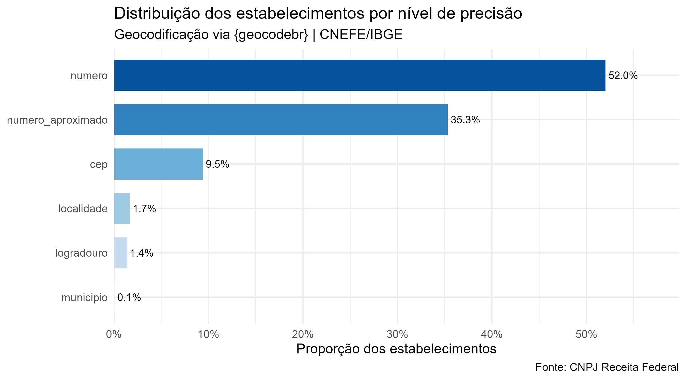
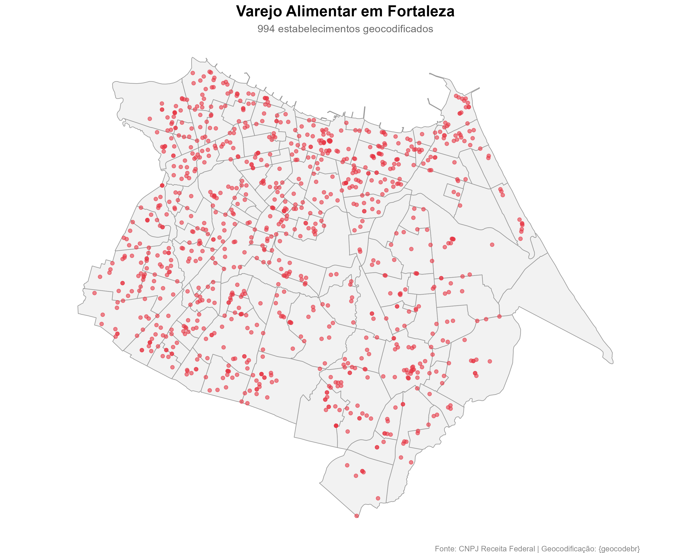
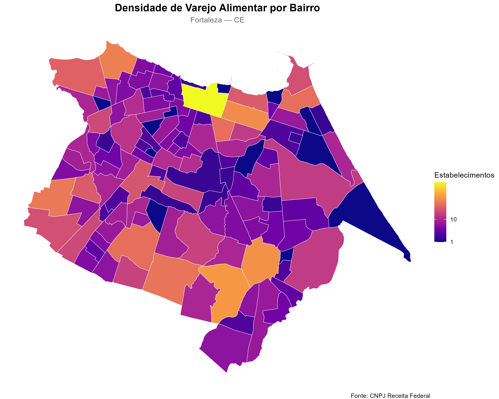
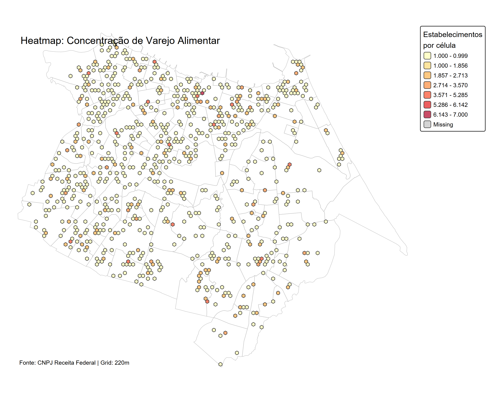
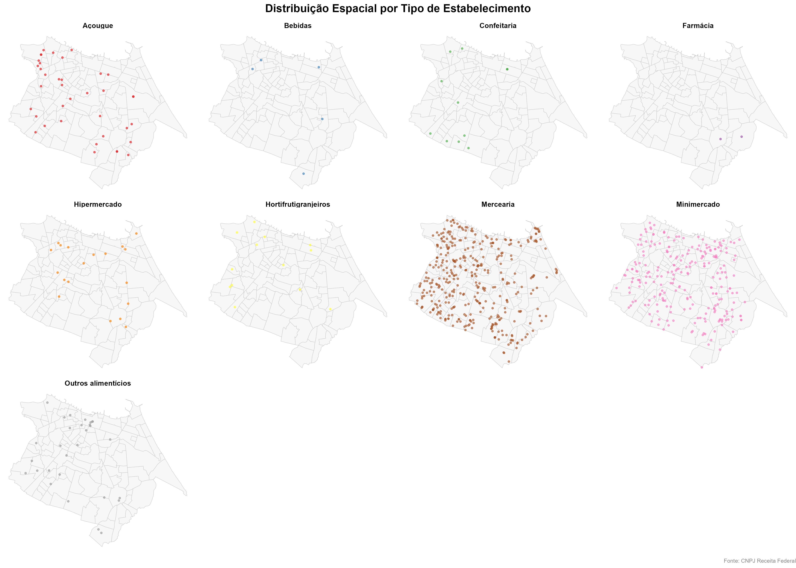

# Introdução

## Contexto

:::::: columns
::: {.column width="60%"}
O **Programa Nutricash** tem por objetivo ampliar o acesso da população em situação de vulnerabilidade alimentar a estabelecimentos de varejo alimentar em Fortaleza.

Para apoiar a gestão e o monitoramento do programa, surge a necessidade de **localizar espacialmente** os estabelecimentos credenciados e compreender sua **distribuição geográfica** na cidade.
:::

:::: {.column width="40%"}
::: {.callout-note icon="false"}
### Problema central

Como identificar e mapear com precisão os estabelecimentos do varejo alimentar em Fortaleza a partir de bases de dados abertas?
:::
::::
::::::

## Motivação

A análise espacial dos estabelecimentos permite:

-   🗺️ **Visualizar** a cobertura territorial do programa
-   📍 **Identificar** áreas com maior e menor concentração de estabelecimentos
-   🔍 **Cruzar** dados do programa com o cadastro oficial da Receita Federal
-   📊 **Subsidiar** decisões de política pública sobre expansão do programa

------------------------------------------------------------------------

# Objetivos

## Objetivo Geral

> Geolocalizar os estabelecimentos de varejo alimentar em Fortaleza cadastrados na base do Programa Nutricash, a partir do cruzamento com o Cadastro Nacional de Pessoa Jurídica (CNPJ) da Receita Federal, e elaborar visualizações cartográficas de sua distribuição espacial.

## Objetivos Específicos

1.  **Processar** a base de estabelecimentos da Receita Federal (arquivos `.ESTABELE`)
2.  **Filtrar** os estabelecimentos de Fortaleza pelos CNAEs do varejo alimentar
3.  **Cruzar** com a lista de estabelecimentos credenciados no Nutricash
4.  **Geocodificar** os endereços utilizando o pacote `{geocodebr}`
5.  **Produzir mapas** com diferentes perspectivas da distribuição espacial

------------------------------------------------------------------------

# Dados Utilizados

## Fontes de Dados {style="font-size: 70%;"}

::::: columns
::: {.column width="50%"}
### 📄 CNPJ — Receita Federal

-   Portal de Dados Abertos do Governo Federal
-   Arquivos brutos: `*.ESTABELE`
-   \~60 milhões de registros no Brasil
-   Atualização mensal
-   Campos: CNPJ, razão social, CNAE, endereço completo, situação cadastral
:::

::: {.column width="50%"}
### 📋 Estabelecimentos Nutricash

-   Base interna de estabelecimentos credenciados
-   Identificação por CNPJ
-   Filtro: município de Fortaleza

### 🗺️ Shapefile de Bairros

-   Polígonos dos bairros de Fortaleza
-   Fonte: i3GeoMap / Prefeitura de Fortaleza
-   CRS: SIRGAS 2000 → reprojetado para WGS84
:::
:::::

<!-- ## Seleção dos CNAEs {style="font-size: 70%;"} -->

<!-- Os estabelecimentos foram filtrados pelos seguintes Códigos CNAE de **varejo alimentar**: -->

<!-- | CNAE                        | Descrição                               | -->
<!-- |-----------------------------|-----------------------------------------| -->
<!-- | 4711301 / 4711302           | Hipermercados e minimercados            | -->
<!-- | 4712100                     | Mercearias e armazéns                   | -->
<!-- | 4721103 / 4721104           | Confeitarias e padarias                 | -->
<!-- | 4722901                     | Açougues                                | -->
<!-- | 4723700                     | Bebidas                                 | -->
<!-- | 4724500                     | Hortifrutigranjeiros                    | -->
<!-- | 4729602 / 4729699           | Produtos naturais e outros alimentícios | -->
<!-- | 4771701 / 4771702 / 4771703 | Farmácias e perfumarias                 | -->

<!-- ------------------------------------------------------------------------ -->

# Ferramentas Utilizadas

## Stack Tecnológico {style="font-size: 70%;"}

::::: columns
::: {.column width="50%"}
### Linguagem e Ambiente

-   **R** (versão ≥ 4.3)
<!-- -   Paradigma funcional com pipeline `|>` -->
<!-- -   Reprodutibilidade via `set.seed(42)` -->

### Orquestração do Pipeline

-   `{targets}` — DAG de dependências
-   `{tarchetypes}` — helpers para targets
-   Reexecução seletiva e cache automático
:::

::: {.column width="50%"}
### Processamento de Dados

-   `{arrow}` — leitura/escrita Parquet
-   `{dplyr}` — manipulação de dados
-   `{readr}` — leitura chunked dos CSVs
-   `{stringr}` — limpeza de strings
-   `{fs}` — manipulação do sistema de arquivos

### Visualização

-   `{ggplot2}` + `{sf}` — mapas estáticos
-   `{leaflet}` — mapa interativo
-   `{tmap}` — heatmap
:::
:::::

## Geocodificação com {geocodebr}

::: {.callout-note icon="false"}
### O que é o {geocodebr}?

Pacote desenvolvido pelo **Ipea** com apoio do **ItpS** para geolocalização de endereços brasileiros, utilizando o **CNEFE/IBGE** como referência — sem limite de consultas e com processamento local.
:::

``` r 
fortaleza |>
  dplyr::mutate(
    logradouro = stringr::str_c(tipo_logradouro, " ", logradouro),
    municipio  = "Fortaleza"
  ) |>
  geocodebr::geocode(
    campos_endereco = geocodebr::definir_campos(
      estado = "uf", municipio = "municipio", cep = "cep",
      logradouro = "logradouro", localidade = "bairro", numero = "numero"
    ),
    resultado_completo   = TRUE,
    padronizar_enderecos = TRUE
  )
```

## Níveis de Precisão do {geocodebr} {style="font-size: 70%;"}

O pacote classifica cada resultado em 6 níveis, do mais ao menos preciso:

| Nível | Descrição |
|----------------------------|--------------------------------------------|
| `numero` | Coordenada calculada a partir do número exato no logradouro |
| `numero_aproximado` | Interpolação espacial quando o número não tem correspondência exata |
| `logradouro` | Centro do logradouro (número ausente ou S/N) |
| `cep` | Centróide do CEP |
| `localidade` | Centróide do bairro |
| `municipio` | Centróide do município |

O pacote também retorna uma estimativa de **incerteza em metros** para cada resultado.

------------------------------------------------------------------------

# Qualidade da Geocodificação

## Código — Distribuição por Nível de Precisão

```r
library(ggplot2)
library(dplyr)
library(scales)
library(forcats)

geoloc_filtrado |>
  count(precisao) |>
  mutate(
    precisao = fct_reorder(precisao, n),
    pct      = n / sum(n)
  ) |>
  ggplot(aes(x = precisao, y = pct, fill = precisao)) +
  geom_col(show.legend = FALSE, width = 0.7) +
  geom_text(aes(label = percent(pct, accuracy = 0.1)),
            hjust = -0.1, size = 3.5) +
  scale_y_continuous(
    labels = percent_format(),
    expand = expansion(mult = c(0, 0.15))
  ) +
  scale_fill_brewer(palette = "Blues", direction = 1) +
  coord_flip() +
  theme_minimal(base_size = 13) +
  labs(
    title    = "Distribuição dos estabelecimentos por nível de precisão",
    subtitle = "Geocodificação via {geocodebr} | CNEFE/IBGE",
    x = NULL, y = "Proporção dos estabelecimentos",
    caption  = "Fonte: CNPJ Receita Federal"
  )

ggsave("output/precisao_barras.png", width = 9, height = 5, dpi = 300, bg = "white")
```

## Proporção por Nível de Precisão

{width="80%" fig-align="center"}

::: {.callout-tip icon="false"}
### Interpretação

Quanto maior a proporção nos níveis `numero` e `numero_aproximado`, melhor a qualidade geral da geocodificação. Proporções elevadas em `cep`, `localidade` ou `municipio` indicam endereços incompletos ou ausentes na base do CNPJ.
:::

------------------------------------------------------------------------

# Mapas

## Mapa 1 — Distribuição Geral dos Estabelecimentos{style="font-size: 70%;"}

{width="68%" fig-align="center"}

<!-- Pontos sobre o mapa de bairros de Fortaleza revelam a **distribuição geográfica bruta** dos estabelecimentos credenciados no Nutricash. -->

## Mapa 2 — Densidade por Bairro (Coroplético){style="font-size: 70%;"}

{width="68%" fig-align="center"}

<!-- Bairros coloridos pela **contagem absoluta** de estabelecimentos, com escala `plasma` em raiz quadrada para lidar com outliers. -->

## Mapa 3 — Mapa Interativo (Leaflet){style="font-size: 70%;"}

O mapa interativo foi exportado como arquivo HTML autocontido:

```         
output/mapa_interativo.html
```

Funcionalidades disponíveis:

-   🔍 **Zoom** livre sobre o mapa base CartoDB Positron
-   📌 **Clustering** automático de pontos no zoom reduzido
-   💬 **Popup** com nome fantasia, CNAE e endereço de cada estabelecimento
-   🗺️ **Minimap** e barra de escala para referência espacial

> Abra `output/mapa_interativo.html` no navegador para exploração completa.

## Mapa 4 — Heatmap de Concentração{style="font-size: 70%;"}

{width="68%" fig-align="center"}

Grid hexagonal de **\~220m por célula** com quebras naturais de Jenks, revelando os núcleos de maior concentração do varejo alimentar.

## Mapa 5 — Distribuição por Tipo de Estabelecimento{style="font-size: 70%;"}

{width="85%" fig-align="center"}

<!-- Painéis separados por CNAE permitem comparar a **distribuição espacial de cada tipo** de varejo alimentar na cidade. -->

------------------------------------------------------------------------

# Resultados e Considerações

## Síntese dos Resultados{style="font-size: 70%;"}

::::: columns
::: {.column width="50%"}
**Processamento**

<!-- -   Base da RF processada em chunks de 500 mil linhas -->
-   Filtro por município: `994` estabelecimentos em Fortaleza
-   Dataset intermediário salvo em Parquet

**Cruzamento**

-   CNPJs do Nutricash comparados com a base da RF
-   Identificação dos estabelecimentos não localizados
:::

::: {.column width="50%"}
**Geocodificação**

-   Endereços padronizados e geocodificados via CNEFE
-   Classificação por nível de precisão (coluna `precisao`)
-   Coordenadas no sistema WGS84 (EPSG: 4326)

**Produtos gerados**

-   4 mapas estáticos (PNG 300 dpi)
-   1 mapa interativo (HTML autocontido)
-   Tabela CSV: estabelecimentos por bairro
-   Gráfico de distribuição por nível de precisão
:::
:::::

## Limitações

-   A **qualidade da geocodificação** depende da completude e padronização dos endereços no CNPJ
-   Endereços incompletos resultam em geocodificação apenas ao nível de **localidade ou município**
-   O CNPJ representa o **endereço de registro fiscal**, que pode diferir do endereço físico
-   Estabelecimentos **sem situação ativa** foram mantidos (`apenas_ativas = FALSE`), podendo incluir empresas inativas

## Próximos Passos

-   [ ] Incluir análise de **acessibilidade** (tempo de deslocamento ao estabelecimento mais próximo)
-   [ ] Cruzar com dados do **CadÚnico** para avaliar cobertura junto à população vulnerável
-   [ ] Automatizar atualização mensal via pipeline `{targets}` + agendamento
-   [ ] Desenvolver **dashboard interativo** (Shiny) para monitoramento contínuo
-   [ ] Validar endereços geocodificados com **baixa precisão** via fontes complementares

------------------------------------------------------------------------

## Referências

BRASIL. **Portal de Dados Abertos**. Cadastro Nacional da Pessoa Jurídica — CNPJ. Disponível em: [dados.gov.br](https://dados.gov.br/dados/conjuntos-dados/cadastro-nacional-da-pessoa-juridica---cnpj). Acesso em: 26 fev. 2026.

PEREIRA, R. H. M.; HERSZENHUT, D. **geocodebr**: Geolocalização de Endereços Brasileiros. Ipea, 2025. Disponível em: [ipeagit.github.io/geocodebr](https://ipeagit.github.io/geocodebr/). Acesso em: 26 fev. 2026.

LANDAU, W. M. **The targets R package**: A dynamic Make-like function-oriented pipeline toolkit for reproducibility and high-performance computing. *Journal of Open Source Software*, v. 6, n. 57, p. 2959, 2021.

------------------------------------------------------------------------

::: {style="text-align: center; margin-top: 200px;"}
### Obrigado

**João Victor Batista Lopes**\
Assessor Técnico \| DISOC – IPECE

*Dados abertos · Código aberto · Ciência reprodutível*
:::
